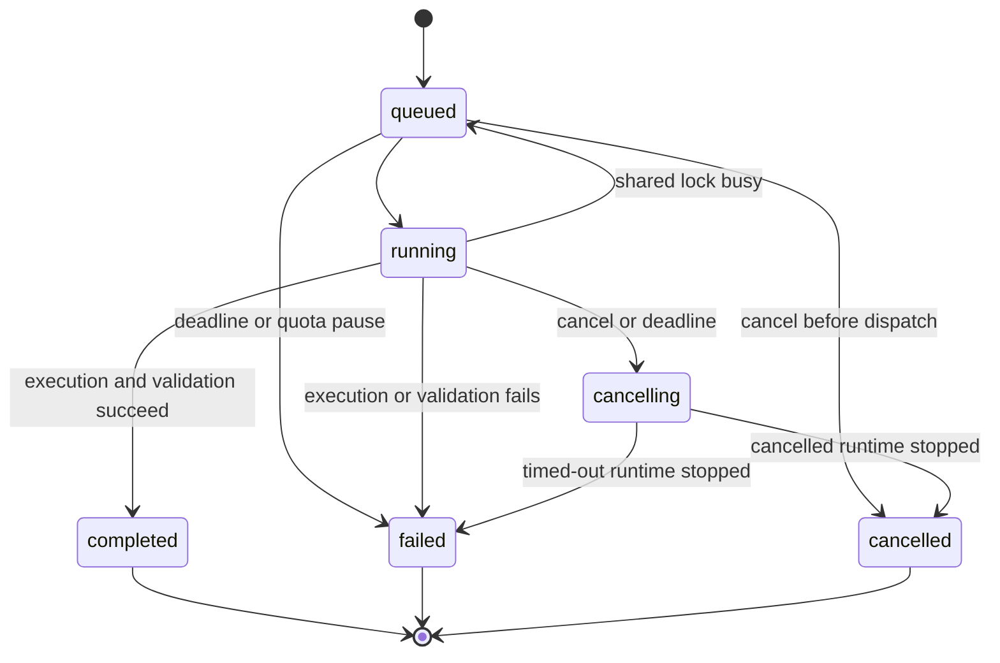
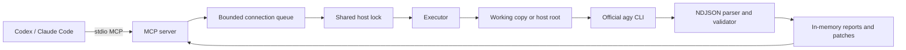

# Antigravity Worker MCP product requirements document (RPD)

Document version: 1.0. Product version: 0.1.0. Updated: 2026-10-02.

This document defines behavior, interfaces, permissions, acceptance criteria and maintenance requirements. Source code, automated tests and the [verification record](verification.md) establish what has been implemented and tested. Roadmap features are outside the current release contract.

## 1. Product definition

Antigravity Worker MCP exposes the official Google Antigravity CLI as an MCP worker for Codex, Claude Code and other host agents. A host supplies a task and its materials. The worker executes it and returns a structured report or patch. The host checks the result before adopting it.

The product uses an installed official `agy` executable and its cached login. It does not implement private model APIs, resell subscription quota, aggregate accounts or rotate identities. The wrapper is MIT-licensed; Google's client, services and models retain their own terms. This is a community project with no Google affiliation.

The intended benefit is to use an existing model allowance for independently verifiable work, including source reading and initial drafts. Speed, accuracy and quota efficiency require task evaluation. A plan multiplier or implementation language alone does not establish those outcomes.

## 2. Background and verified constraints

| Constraint | Product consequence | Source |
| --- | --- | --- |
| The official CLI supports headless execution, structured output and streaming stdin input. | Use a subprocess adapter and structured events without private APIs. | [Headless documentation](https://antigravity.google/docs/cli/headless/) |
| Headless execution permits workspace reads and writes by default, but other actions can be denied while the CLI continues. | Exit code zero alone does not prove success. Automatic execution needs an explicit permission flag; read-only inputs need an execution boundary. | [Permissions](https://antigravity.google/docs/permissions/) |
| Ultra 20X is relative to Pro. Gemini models share a usage-weighted allowance; third-party models have separate limits. | Configure model profiles explicitly. Do not describe every model as having twenty times the request count. | [Plan changes](https://antigravity.google/blog/changes-to-antigravity-plans) |
| Ultra has five-hour refresh and weekly limits. Overage follows account settings. | Report observed usage, keep remaining quota unknown, and leave overage settings unchanged. | [Plans](https://antigravity.google/docs/plans) |
| Both target clients support local stdio MCP servers. | Start with stdio and asynchronous task interfaces. | [Codex](https://learn.chatgpt.com/docs/extend/mcp), [Claude Code](https://code.claude.com/docs/en/mcp) |

Plans, model catalogs and CLI protocols can change. Each release records its verification date and versions. Historical catalog queries do not establish current account capabilities.

## 3. Users, roles and use cases

| Role | Responsibility | Required capabilities |
| --- | --- | --- |
| Operator | Install the CLI, configure models and paths, maintain compatibility. | Inspectable configuration, reproducible builds, clear failures and cleanup instructions. |
| Codex or Claude Code host agent | Split work, select materials, submit tasks and verify results. | Bounded asynchronous tools, evidence, patches and explicit incomplete states. |
| Developer or researcher | Review findings and perform final operations. | Readable summaries, source locations, original links and check reports. |
| Contributor | Reproduce issues and maintain the implementation. | Documented interfaces, account-free tests, contribution rules and version records. |

Initial use cases:

1. Repository analysis: locate entry points, call relationships and implementations, with relative paths, line numbers and evidence.
2. Independent review: inspect selected code or differences, with severity, triggering conditions and verification methods.
3. Technical research: summarize official documentation, version constraints and original links; identify unreachable sources and missing information.
4. Text extraction: extract fields, classifications or timelines from selected UTF-8 materials, with an explicit input scope.
5. Coding: modify a working copy or an original project and report changes and checks. Working-copy execution returns a patch.

Initial tasks need an independent acceptance condition, such as analyzing a fixed file set with source references. The host splits batches into bounded tasks. Version 0.1 does not provide an indefinite agent loop.

## 4. Goals and scope

### 4.1 Goals

| ID | Goal | Observable condition |
| --- | --- | --- |
| G-01 | Make the official CLI callable through MCP. | Initialization, discovery, submission, status, retrieval and cancellation work together. |
| G-02 | Provide broad-permission headless execution. | Default execution has no isolation and passes automatic approval; file changes and commands are permitted. |
| G-03 | Separate long tasks from client tool-call deadlines. | Submission returns an ID while execution continues in the background. |
| G-04 | Preserve actual completion and failure information. | Timeouts, denials, malformed results and quota failures cannot become complete success. |
| G-05 | Support public maintenance. | Source, MIT license, lock file, tests, CI, requirements, installation and release documentation are available. |

### 4.2 Initial release

Version 0.1 provides five tools, five task categories, three execution modes, a same-host execution lock, bounded connection-local queues, paged reports and patches, cancellation, deadlines, error classification and temporary-data cleanup.

Host mode supports Linux, macOS and Windows on x86-64 and ARM64. Workspace and analysis isolation require Linux. The implementation uses Rust and the official RMCP SDK. Deployment requires one executable and no Node.js runtime. Default host execution operates on the original project with the current user's permissions and automatic approval. Optional workspace execution copies selected files rather than traversing an entire repository.

Workspace patches are returned for review and are not automatically applied. The wrapper itself does not append Git commits, pushes or merges. A host task with broad command permissions can perform operations within its instructions, so the caller must define the intended scope.

### 4.3 Later releases

A shared job broker, cross-client result access, account-wide quota pause, Git worktrees, complete repository snapshots, persistent sessions, restart recovery, task-quality evaluation, isolation on additional operating systems and package registries are later milestones.

## 5. Execution modes and authorization

| Mode | Selection | File access | Commands and network | Deliverables |
| --- | --- | --- | --- | --- |
| `host` | Default; `isolation: false`; host execution enabled by default. | Original working directory and other resources accessible to the current user. | Broad permissions; existing host environment and CLI settings apply. | Report; no automatic workspace patch. |
| `workspace` | `isolation: true` or explicit workspace mode. | Writable copy of selected files. | Automatic approval inside Bubblewrap; networking enabled. | Report and patch. |
| `analysis` | Explicit analysis mode. | Read-only input copy. | Commands, writes and MCP denied; URL reads use configured domains. | Report. |

Host and workspace modes pass `--dangerously-skip-permissions`; they do not request per-action terminal confirmation. Headless mode alone is not an automatic-approval setting. No `agy-yolo` executable or alias is required. Non-Linux systems explicitly reject workspace and analysis requests without host fallback.

Host execution inherits the launching environment and existing CLI configuration. `isolation` defaults to false. Setting it to true resolves host mode to workspace; explicit analysis remains read-only. An operator can disable host execution, in which case default host submissions fail explicitly. Tool-call approval in Codex or Claude Code remains controlled by that client.

The host `allowedRoots` list validates starting directories. It is not a filesystem sandbox and does not restrict paths later accessed by commands. Isolated modes keep the original input root outside the mount namespace. Runtime and authentication mounts must be documented.

Isolated execution uses generated settings rather than inheriting personal MCP connections, skills, hooks or project configuration directories. Host execution retains existing CLI settings, so configured hooks or external tools can run. Operators need to review those settings.

Language runtime requirements are deployment-specific. Broad command execution does not implement a general interpreter-policy auditor. Deployments requiring enforced interpreter or environment-manager policies need a tested command boundary.

## 6. User flows

### 6.1 Installation and first connection

Install and authenticate the official CLI, configure model slugs and allowed roots, build or install the worker, register it with a client, query capabilities, submit a small task, and verify its result.

Capability queries read the CLI version and live catalog without model inference. Invalid configuration fails startup. Authentication and model failures are reported when queried or executed. Isolation prerequisites are checked for isolated tasks; default host startup does not require Bubblewrap or Git. The worker does not install clients, acquire accounts or silently choose another model.

### 6.2 Asynchronous task

The host supplies a scope and objective. Submission returns an ID and deadline. The host can continue other work, query progress, retrieve the completed report in pages, and check file references, links or test claims before adopting the result.

The deadline includes queue and lock wait time. A busy execution lock cannot cause indefinite waiting. Queued cancellation does not launch the CLI. Running cancellation waits for supervised process termination and local cleanup.

### 6.3 Coding and patches

In workspace mode, the host selects source files, dependency manifests and check materials. The worker modifies the copy and performs permitted checks. It returns a report and actual differences. The host reads the complete patch, checks applicability and runs appropriate validation before applying it.

In default host mode, the CLI operates directly on the configured original directory. The host inspects actual changes and reported checks. Preservation of existing changes, commits, rollback and remote operations depend on the task's policy. The wrapper provides no automatic host rollback.

## 7. Functional requirements

P0 is the initial release scope. P1 and P2 are later milestones.

| ID | Priority | Requirement | Acceptance |
| --- | --- | --- | --- |
| F-01 | P0 | Stdio initialization and discovery. | A real protocol test initializes and discovers five tools. |
| F-02 | P0 | Asynchronous submission. | Return UUID, queued state, resolved mode and deadline. |
| F-03 | P0 | Five task kinds and three modes. | Validate enums and reject disabled host mode before dispatch. |
| F-04 | P0 | Bounded queues and result storage. | Reject at capacity without evicting retained results. |
| F-05 | P0 | Same-host execution lock. | Only one task executes for a shared state directory. |
| F-06 | P0 | Status and progress. | Return timestamps, event and step counters, and output bytes. |
| F-07 | P0 | Structured reports. | Validate summary, findings, severity, evidence and limitations. |
| F-08 | P0 | File and URL evidence validation. | Isolated results reject unselected files, invalid input lines and non-HTTP(S) URLs. |
| F-09 | P0 | Report and patch pagination. | Follow offsets to retrieve complete retained content. |
| F-10 | P0 | Cancellation and deadlines. | Stop supervised execution and clean temporary data before terminal cancellation. |
| F-11 | P0 | Live capability queries. | Report version, actual catalog, modes, limits and unavailable quota information. |
| F-12 | P0 | Explicit model mapping. | Configure fast/deep profiles; reject missing profiles without substitution. |
| F-13 | P0 | Quota pause. | A quota or capacity error prevents later dispatch in that connection. |
| F-14 | P0 | Authentication reuse. | Use cached official CLI login without reading, printing or copying credential values. |
| F-15 | P0 | Working-copy differences. | Return changes, additions and deletions; verify patch application on a synthetic sample. |
| F-16 | P0 | Explicit isolation failure. | Reject an isolated task when isolation is unavailable; never fall back to host execution. |
| F-17 | P1 | Shared job broker. | Both clients can query one job with shared scheduling, quota pause and cancellation. |
| F-18 | P1 | Git worktree coding. | Preserve baseline commit, existing changes and conflicts without automatic merging. |
| F-19 | P1 | Recovery and idempotency. | Distinguish undispatched, interrupted and complete jobs; repeated keys do not create extra executions. |
| F-20 | P1 | Strict command boundary. | Enforce interpreter, path, network and tool policies, including bypass cases. |
| F-21 | P2 | Persistent sessions and alternative backends. | Verify authentication, quota, context and capabilities before adding an official SDK or persistent CLI. |
| F-22 | P2 | More platforms and registries. | Perform platform integration checks and publish a support matrix with signed artifacts or checksums. |

## 8. MCP interface contract

The [protocol reference](protocol.md) defines JSON fields and examples. Tools expose product parameters rather than arbitrary CLI argument arrays or shell-interpolated commands.

### 8.1 ag_submit

| Parameter | Type | Default or range |
| --- | --- | --- |
| `kind` | Enum | repository_analysis / review / research / extraction / code. |
| `instructions` | String | Required; 1 to 16,000 characters; passed through memory and CLI stdin. |
| `isolation` | Boolean | False by default; true selects a working copy. |
| `execution_mode` | Enum | Host by default; workspace or analysis optional; isolation resolves host to workspace. |
| `root` | String | Required for host tasks or selected files; absolute allowed root. |
| `files` | String array | Empty by default; at most 100 relative file paths; no recursive expansion. |
| `model_profile` | Enum | Fast by default; deep must be configured. |
| `timeout_seconds` | Integer | 1 to 900 seconds; otherwise the server default. |

Return `job_id`, `state: queued`, `execution_mode` and `deadline`. Timestamp fields use Unix milliseconds. Submission is not idempotent. There is no automatic task retry; callers must not repeatedly submit after losing a response.

### 8.2 ag_status

Input is `job_id`. Return state, task kind, resolved mode, submission/start/end timestamps, bounded progress, completion, error and connection pause status. Event counts are not tool-call counts or a percentage of completion.

### 8.3 ag_result

Input is `job_id`, `offset`, `limit` and `section`, where section is response or patch. An unfinished job returns `ready: false`.

Terminal results include completion, summary, bounded finding previews, total finding count, limitations, input fingerprints, selected and actual models, CLI status, usage, error, a text page, next offset and expiry. The complete validated report is in response pages; previews do not replace it.

All reports have `verification_status: unverified`. Valid structure and source locations do not prove a correct conclusion. A patch exceeding its delivery limit has a truncation flag; it cannot be treated as a complete applicable patch.

### 8.4 ag_cancel

Input is `job_id`. Queued jobs cancel directly. Running jobs enter cancelling, stop the supervised process group, and wait for cleanup before returning terminal state and `process_stopped`.

PID isolation constrains descendants in isolated modes. Host supervision covers the CLI and its process group; a detached session, external service or other side effect can survive. Cancelling a terminal job returns its current state without repeating operations.

### 8.5 ag_capabilities

Input is an empty object. Return CLI version, live catalog, configured profiles, modes, automatic-approval behavior, default mode, lock scope, input/output limits, quota availability and connection pause status.

Remaining subscription quota is explicitly unavailable. CLI token usage must not be converted into unverified remaining request counts.

## 9. Job state and completion

Completed means execution and format validation finished. It does not mean that the host verified the model's conclusions. Failed or cancelled jobs are incomplete even if they produced partial text or changes.

A busy shared lock causes lock-acquisition retries, not repeated inference. Lock fairness is not guaranteed. Jobs belong to their creating connection; another client cannot query those IDs.

## 10. Errors and degraded behavior

| Category | Representative codes | Behavior |
| --- | --- | --- |
| Configuration or platform | CONFIG_INVALID / UNSUPPORTED_PLATFORM | Fail startup with a sanitized reason. |
| Optional isolation | SANDBOX_UNAVAILABLE / ISOLATION_UNSUPPORTED | Fail the requested isolated operation without host fallback. |
| Input scope | INPUT_SCOPE_INVALID / INPUT_FORMAT_INVALID / INPUT_TOO_LARGE / INPUT_CHANGED | Keep invalid materials out of the CLI input copy. |
| Queue or results | QUEUE_FULL / RESULT_STORE_FULL / JOB_NOT_FOUND | Reject explicitly without removing retained results. |
| Authentication or models | AUTH_REQUIRED / MODEL_UNAVAILABLE | Require official CLI login or configuration repair; do not switch identities or models. |
| Quota or capacity | QUOTA_EXHAUSTED / QUOTA_PAUSED | Stop dispatch in that connection until external review and restart. |
| Permissions or host mode | PERMISSION_DENIED / HOST_MODE_DISABLED | Mark incomplete without silently broadening execution. |
| Lifecycle | TIMEOUT / CANCELLED | Stop supervised execution, clean temporary data and return terminal state. |
| Stream or result | STREAM_INVALID / OUTPUT_LIMIT / RESULT_SCHEMA_INVALID / EVIDENCE_INVALID | Mark incomplete; retain validated or bounded partial information when available. |
| Patch | PATCH_FAILED | Do not claim that an applicable patch was delivered. |

Diagnostic text classification is a compatibility layer and needs fixtures as CLI behavior changes. Unknown errors remain generic. Raw stderr is not returned because it can contain sensitive data. Success requires compatible terminal JSON, CLI status, process exit, permission checks and report validation together.

## 11. Data, inputs and retention

| Data | Location | Default retention | Output |
| --- | --- | --- | --- |
| Task instructions | Process memory and subprocess stdin. | Input references released after terminal completion. | Excluded from wrapper logs and persistent reports. |
| Selected materials | Private temporary copy. | Until execution and cleanup finish. | Relative paths, SHA-256, bytes and line counts. |
| Isolated CLI history | Private mount namespace. | Discarded when the runtime exits. | Not copied into source or reports. |
| Reports and patches | MCP process memory. | One hour after terminal completion; cleared on disconnect. | Character pages. |
| Execution lock | User-private state directory. | May remain between executions. | No task text or credential values. |
| Host CLI history | Official CLI data directories. | Official CLI and account settings. | The wrapper does not promise to remove it. |

Captured inputs are UTF-8 text: at most 100 files, 256 KiB each and 4 MiB total. Reject absolute file paths, traversal, symlinks, hardlinks, binary data, obvious credential names and configuration directories. Filename filtering does not redact secrets embedded in ordinary source files. The caller must select materials appropriate for the task.

The official CLI, host client and provider have separate history, telemetry and retention behavior. The product cannot promise end-to-end absence of records. Authentication is made available to the official CLI without the wrapper reading or duplicating its values.

## 12. Architecture and implementation constraints

Rust, the official RMCP SDK, Tokio and Serde produce one native executable per platform and architecture. Subprocesses receive argument arrays without shell interpolation. Instructions go through stdin to keep them out of process arguments. Events and diagnostics have a total output ceiling and are not persisted as raw logs. Unix supervision uses process groups; Windows uses a kill-on-close Job Object assigned before task stdin is delivered.

Isolated execution needs private PID and mount namespaces. The original input root is not mounted. Document system programs, additional runtime paths and authentication mounts. Network access is not a domain firewall.

Protocol, scheduling, execution, input capture and validation remain separate modules so the backend can be replaced. The shared lock coordinates instances on one host using the same state directory. It is not a distributed lock and does not provide a cross-machine account budget.

## 13. Configuration and deployment

| Setting | Purpose | Default |
| --- | --- | --- |
| agyPath | Absolute official CLI executable path. | Required. |
| allowedRoots | Allowed input roots or host starting directories. | Empty array. |
| models.fast / models.deep | Explicit model profile mapping. | Fast required; deep optional. |
| allowHostExecution | Permit direct original-directory execution. | True. |
| researchDomains | Analysis URL-read domains. | Empty array. |
| runtimePaths | Additional read-only isolated toolchain directories. | Empty array. |
| stateDirectory | Private temporary data and shared lock. | User-local state directory. |
| timeoutSeconds | Default deadline including queue wait. | 300 seconds. |
| maxQueue | Maximum unfinished jobs per connection. | 8. |
| maxJobs | Maximum retained jobs per connection. | 64. |
| retentionSeconds | Terminal result retention. | 3,600 seconds. |

Configuration has strict structural validation. Paths are absolute. Unix state directories belong to the current user with mode 0700. Windows defaults to the user's local application-data directory, rejects reparse-point state directories, and relies on inherited Windows ACLs rather than enforcing a custom ACL. Operators selecting another Windows state directory must restrict access appropriately. Model slugs come from the live catalog; fixed historical names are not capability discovery.

Install from Cargo source builds or GitHub release executables. Native CI builds, tests and packages Linux, macOS and Windows on both x86-64 and ARM64. Version tags publish six archives plus SHA-256 checksums after every target succeeds. Default host mode needs an authenticated `agy`. Bubblewrap and working user namespaces are Linux-only isolation requirements; Git is needed for workspace patches. Version 0.1 does not require a cloud daemon. Each client launches a stdio process, with shared locking when instances use the same state directory.

Uninstallation removes client registrations and wrapper files. Stop relevant connections and confirm no task is running before cleaning state. Do not automatically remove the official CLI, login, projects or account history.

## 14. Nonfunctional requirements and metrics

| ID | Requirement | Initial validation |
| --- | --- | --- |
| N-01 | Protocol interoperability. | Official SDK clients validate initialization, discovery, invocation and shutdown. |
| N-02 | Asynchronous submission latency. | Submission does not wait for inference; local P95 below one second is a target, not a measured guarantee. |
| N-03 | Bounded resources. | Queue, file, instruction, output, result-count and retention limits have explicit failures. |
| N-04 | Supervised cancellation. | Verify termination and cleanup; document the host detached-process boundary. |
| N-05 | Auditable state. | Query usage, mode, model and errors without fabricated quota or percentage progress. |
| N-06 | Reproducible dependencies. | Commit lock file, pin the SDK and CI actions, and publish artifact checksums. |
| N-07 | Maintainability. | Account-free tests cover protocol, lifecycle, input scope and locking. |
| N-08 | Explicit portability. | Publish a support matrix and distinguish tested platforms and clients from unverified ones. |

Later task evaluation must record sample counts, CLI/model versions, success rate, verifiable-result rate, elapsed time, host reading volume, token usage, failure categories, patch applicability and check outcomes. Prepare at least ten public reproducible samples per task category before comparing profiles with direct host-agent execution.

Model-quality evaluation is separate from engineering checks. One successful request cannot establish complex coding accuracy. Token counts cannot establish remaining subscription quota.

## 15. Test and release acceptance

| ID | Scenario | Required outcome |
| --- | --- | --- |
| A-01 | Initialization and discovery. | Five tools available; server stdout contains only protocol messages. |
| A-02 | Standard task. | Submission, status, complete structured report and page reconstruction work. |
| A-03 | Official CLI. | A small real-model task records CLI status, actual model and usage. |
| A-04 | Workspace edits. | Changes and new files generate an applicable patch; original input bytes remain unchanged. |
| A-05 | Read-only analysis. | Mounts deny an actual write; denial causes failure even with exit code zero. |
| A-06 | Cross-connection lock. | Another instance cannot execute until the first releases the shared lock. |
| A-07 | Queued and running cancellation. | Both reach terminal state; running cancellation waits for runtime exit and cleanup. |
| A-08 | Deadlines and invalid output. | Execution ends within supervision bounds; malformed, excessive and duplicate terminal output fails. |
| A-09 | Input escape. | Traversal, symlinks, hardlinks, credential paths, excessive or non-text materials are rejected. |
| A-10 | Models and quota. | Missing profiles fail; quota errors pause later dispatch; inference is not silently retried. |
| A-11 | Retention and disconnect. | Storage limits fail explicitly; expiry and disconnect release results and stop tasks. |
| A-12 | Both host clients. | Record connection, discovery, capabilities, real dispatch and cancellation separately for each client. |
| A-13 | Host mode. | Configuration toggle works; temporary-project checks cover commands and changes without claiming rollback. |
| A-14 | Public content. | Staged content excludes credentials, personal configuration, real instructions and session data. |
| A-15 | Open-source delivery. | Public repository, MIT license, English documentation, six-target CI, version tag, source and verified platform archives. |

An experimental 0.1 release can disclose unverified items. A stable release requires both host-client workflows, real-provider host execution, complex tasks and platform compatibility checks. The [verification record](verification.md) distinguishes completed checks from those gaps.

## 16. Open-source maintenance

The repository includes Rust source, tests, lock file, MIT license, English README, RPD, protocol, architecture, verification record, contribution guide, security policy, changelog and CI. Documentation, comments, examples, issue templates and release notes use English.

Do not distribute the official CLI, authentication caches, account history, real task materials or private API implementations. Community projects are public references. Any future code reuse must retain its original source attribution and license. The current CLI adapter is independently implemented.

Each release updates versions, supported environments, verification and changelog. A breaking CLI change ends compatibility claims until fixtures and failure tests support a fix. Use private vulnerability reporting rather than uploading sensitive logs to public issues.

Contributors run compilation, lint, tests, format and package-content checks. CI uses no personal model credentials and consumes no provider quota. Releases use immutable version tags and SHA-256 checksums. Registry publishing separately requires account and package-name validation.

## 17. Milestones and completion criteria

| Milestone | Deliverables | Completion |
| --- | --- | --- |
| M0: experimental 0.1 | Five tools, host/workspace/analysis modes, lifecycle, reports, patches and complete public project. | Engineering tests and small official CLI checks pass; verification gaps are published; source and artifacts are accessible. |
| M1: shared broker and coding | Cross-client jobs, account-wide pause, worktrees, broader input strategies and command policies. | Concurrent-client, recovery, conflict and runtime-policy cases pass. |
| M2: evaluation and platforms | Task benchmarks, profile selection, persistent sessions, more platforms and registries. | Publish reproducible results, platform acceptance and migration/maintenance procedures. |

Milestones do not assign speculative release dates or model-quality scores. Completion depends on delivered and verified behavior.

## 18. Risks and decisions

| Risk | Current measure | Remaining boundary or later decision |
| --- | --- | --- |
| CLI protocol or authentication locations change. | Adapter, version query and real CLI checks. | Continued maintenance; unknown versions are not guaranteed compatible. |
| Broad-permission tasks affect the host. | Explicit defaults and resolved modes; optional isolation and host-disable setting. | Default tasks have current-user privileges and no automatic rollback. |
| Hostile materials induce commands or disclosure. | Original input root absent from isolation, generated settings, selected input scope. | Network and authentication mounts still require trusted tasks; no exfiltration guarantee. |
| Quota and charges are unpredictable. | Shared host lock, finite deadlines, no inference retries and connection quota pause. | Existing account overage applies; remaining quota is unknown. |
| Well-formed reports contain wrong conclusions. | Unverified status, source-location bounds and patch applicability checks. | Semantic correctness needs host verification and task evaluation. |
| Jobs or results are lost. | Explicit connection ownership, retention and errors. | No durable recovery, idempotency or cross-client lookup in 0.1. |
| Commands exhaust disk or compute. | Input/output bounds, cleanup and finite supervised execution. | Arbitrary commands need cgroups or quotas for hard CPU, memory and disk limits. |

## 19. Public references

Community implementations provide comparison points for queues, CLI adaptation and isolation:

- [j-agy-mcp](https://github.com/PichurChill/j-ai-kit/tree/main/packages/j-agy-mcp): asynchronous task and status interfaces.
- [antigravity-mcp-server](https://github.com/x51xxx/antigravity-mcp-server): review, background-task and worktree tools.
- [ask-llm Antigravity adapter](https://github.com/Lykhoyda/ask-llm/tree/main/packages/antigravity-mcp): isolation and read-only capability boundaries.
- [Official Rust MCP SDK](https://github.com/modelcontextprotocol/rust-sdk): protocol implementation.

These are references, not Google-operated MCP services or runtime dependencies. Read current upstream source and verify behavior before adopting additional capabilities.
